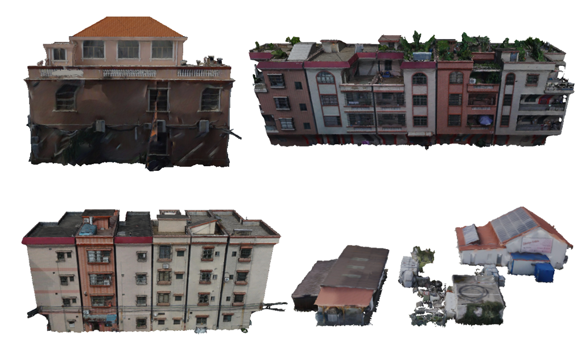
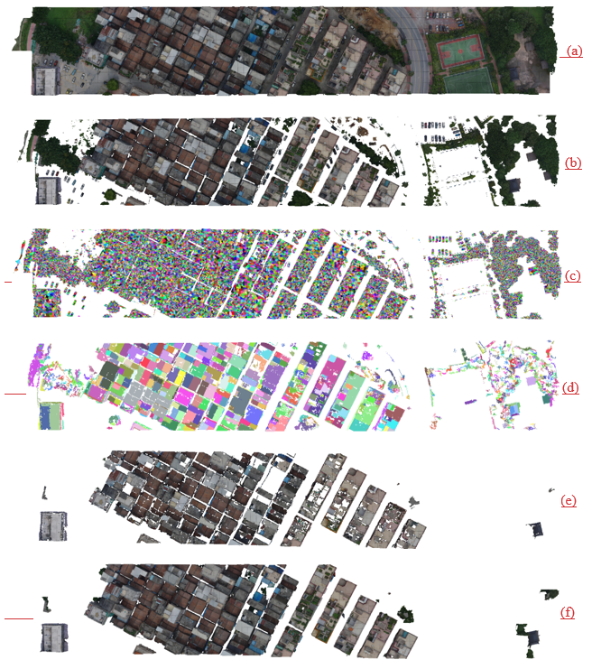

# BuildingEx4Mesh

This is the  C++ implementation and Gm4B dataset of our paper [A Bidirectionally Greedy Framework for Unsupervised 3D Building Extraction from Airborne-based 3D Meshes](https://xxxx8.pdf) that has been accepted to Automation in Constrution.

Author: Wuhan University, dayuyu@whu.edu.cn

## Citation

```
@article{yu2023building,
  title={A Bidirectionally Greedy Framework for Unsupervised 3D Building Extraction from Airborne-based 3D Meshes},
  author={Dayu Yu, Peng Yue, Fan Ye, Deodato Tapete, Zheheng Liang},
  journal={Automation in Construction},
  year={2023}
}
```

# Get Started

## Environment

Install dependencies

```
C++17
OpenMP
QT 5.12.11
CGAL
```



